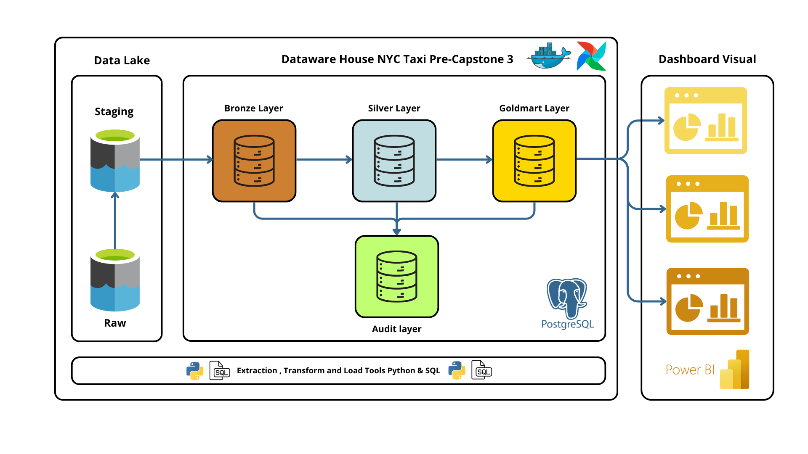
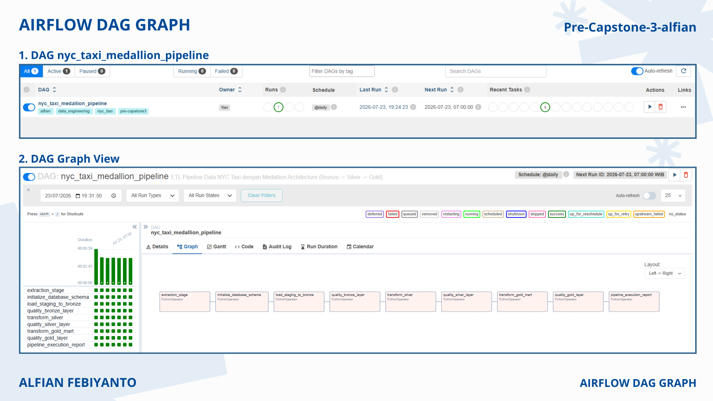
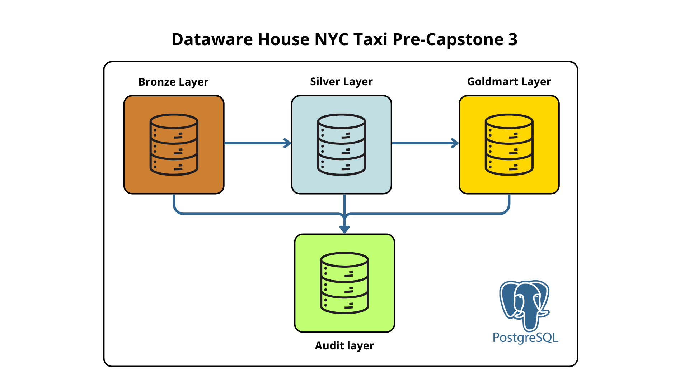
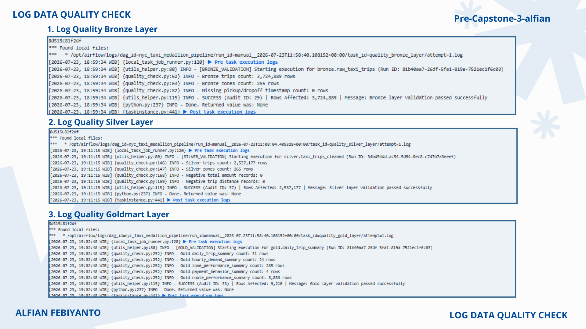

# Pre-Capstone Project 3 — NYC Taxi Data Pipeline (Medallion Architecture)

[](https://www.python.org/)
[](https://www.postgresql.org/)
[](https://airflow.apache.org/)
[](https://www.docker.com/)

An end-to-end local data pipeline for processing the **NYC Taxi** dataset using **Apache Airflow**, **PostgreSQL**, **Python**, and **Docker Compose**, built on a **Medallion Architecture (Bronze → Silver → Gold)** approach complete with **Data Quality Checks**, **Business Analytics Logging**, and **Audit Trail Logging** at every stage.

This project is a transitional exercise from Capstone Project 2 toward Capstone Project 3 (the cloud-based version), focusing on pipeline orchestration, a local data lake, a data warehouse, data transformation, and containerization.

---

## Table of Contents

- [Pre-Capstone Project 3 — NYC Taxi Data Pipeline (Medallion Architecture)](#pre-capstone-project-3--nyc-taxi-data-pipeline-medallion-architecture)
  - [Table of Contents](#table-of-contents)
  - [1. Objective \& Dataset](#1-objective--dataset)
  - [2. Pipeline Architecture](#2-pipeline-architecture)
    - [Pipeline Stages](#pipeline-stages)
      - [1. Extract \& Staging](#1-extract--staging)
      - [2. Bronze Layer (Raw Storage)](#2-bronze-layer-raw-storage)
      - [3. Silver Layer (Cleansing \& Transformation)](#3-silver-layer-cleansing--transformation)
      - [4. Gold Layer (Data Marts \& Analytics)](#4-gold-layer-data-marts--analytics)
      - [5. Pipeline \& Validation Report](#5-pipeline--validation-report)
  - [3. Project Folder Structure](#3-project-folder-structure)
  - [4. How to Run the Project](#4-how-to-run-the-project)
    - [Step 1 — Clone the Repository](#step-1--clone-the-repository)
    - [Step 2 — Prepare the Environment File](#step-2--prepare-the-environment-file)
    - [Step 3 — Make Sure Docker Desktop Is Running](#step-3--make-sure-docker-desktop-is-running)
    - [Step 4 — Start the Services via Docker Compose](#step-4--start-the-services-via-docker-compose)
    - [Step 5 — Trigger the DAG](#step-5--trigger-the-dag)
  - [5. Environment Variables](#5-environment-variables)
  - [6. Airflow DAG \& Task Dependency](#6-airflow-dag--task-dependency)
    - [Task Order (Grid/Graph View)](#task-order-gridgraph-view)
  - [7. Database Design \& Schema](#7-database-design--schema)
    - [A. Audit Schema (`audit`)](#a-audit-schema-audit)
    - [B. Bronze Layer (`bronze`)](#b-bronze-layer-bronze)
    - [C. Silver Layer (`silver`)](#c-silver-layer-silver)
    - [D. Gold Layer (`gold`) — Data Mart](#d-gold-layer-gold--data-mart)
  - [8. Data Quality Check](#8-data-quality-check)
  - [9. Idempotency \& Rerun Safety](#9-idempotency--rerun-safety)
  - [10. Monitoring \& Result Verification](#10-monitoring--result-verification)
    - [Verification via Airflow UI](#verification-via-airflow-ui)
    - [Verification via PostgreSQL Query](#verification-via-postgresql-query)
  - [11. Assumptions \& Technical Limitations](#11-assumptions--technical-limitations)

---

## 1. Objective & Dataset

| Item | Description |
| :--- | :--- |
| **Objective** | Build an end-to-end local data pipeline as a hands-on exercise before the cloud-based Capstone Project 3 |
| **Dataset** | NYC Taxi Trip Data (`.parquet`) and Taxi Zone Lookup (`.csv`) — the same dataset used in Capstone Project 2 |
| **Tools** | Apache Airflow, PostgreSQL, Python, Docker & Docker Compose, SQL |
| **Approach** | Medallion Architecture (Bronze → Silver → Gold) + Audit Logging + Data Quality |
| **Grading** | No numeric grading — the requirement document serves as a readiness checklist |

---

## 2. Pipeline Architecture


*Figure 1: Data Pipeline Architecture & Medallion Architecture*

### Pipeline Stages

#### 1. Extract & Staging

* **Raw Ingestion**: Downloads raw datasets from the source URL (`raw-taxi-trips.parquet` and `raw-taxi-zones.csv`) into the `data_lake/raw/` directory.
* **Data Structuring**: Performs a quick clean to align data types and tidy up the initial data structure.
* **Staging Output**: Saves the initial output to `data_lake/staging/` under the name `stag-taxi-trips`, ready to be loaded into the database.

#### 2. Bronze Layer (Raw Storage)

* **Schema Initialization**: Automatically initializes the `bronze` database schema along with the main table DDLs.
* **Automated Bulk Load**: Moves data from `data_lake/staging/` and the zone lookup into PostgreSQL using a bulk loading mechanism.
* **Lineage Preservation**: Keeps the original data format with minimal changes to preserve source data for auditability needs.

#### 3. Silver Layer (Cleansing & Transformation)

* **Data Cleansing**: Validates and filters out raw data anomalies (e.g., fare ≤ 0 or trip distance ≤ 0).
* **Feature Enrichment**: Generates ready-to-use, business-friendly columns to make analytical queries easier.
* **Quality Quarantine**: Separates invalid records into a dedicated `silver.data_quality_issues` table for data quality assurance analysis.

#### 4. Gold Layer (Data Marts & Analytics)

* **Data Mart Aggregation**: Builds aggregated analytical data marts (daily performance, peak-hour patterns, by zone, and by payment method).
* **Reporting Views**: Provides dedicated views optimized for querying, dashboarding, and business reporting needs.
* **Business Insights**: Surfaces key, actionable business metrics ready to be consumed to speed up strategic decision-making.

#### 5. Pipeline & Validation Report

* **Execution Summary**: Compiles a comprehensive pipeline execution summary, including runtime benchmarks and total rows processed.
* **Multi-Layer Validation**: Automatically runs data quality checks at every layer (Bronze, Silver, Gold).
* **Audit Trail Logging**: Records the final validation status and execution statistics to `audit.load_audit` using the **Asia/Jakarta (WIB)** time standard.

---

## 3. Project Folder Structure

```text
pre-capstone-project-3/
│
├── dags/
│   └── taxi_pipeline.py            # Main DAG: nyc_taxi_medallion_pipeline
│
├── data_lake/                      # Local data lake
│   ├── raw/
│   └── staging/
│
├── docs/
│   └── images/
│
├── logs/                           # Execution logs & business analytics log
│
├── scripts/
│   ├── extract.py                  # Raw data ingestion script
│   ├── initial_database.py         # DB schema initialization script
│   ├── load_to_postgres.py         # Script to load data into Bronze
│   ├── quality_check.py            # Data quality validation engine
│   ├── transform.py                # Silver & Gold transformation script
│   └── utils_helper.py             # Helper functions
│
├── sql/
│   ├── 01-schema.sql               # DB schema DDL script
│   ├── 02-bronze.sql               # Bronze layer DDL script
│   ├── 03-silver.sql               # Silver layer ETL script
│   └── 04-gold-mart.sql            # Gold Data Mart aggregation script
│
├── .env.example                    # Environment configuration template
├── .gitignore
│
├── docker-compose.yml              # Airflow & PostgreSQL container configuration
├── Dockerfile                      # Custom Airflow image
├── .dockerignore
│
├── requirements.txt
├── README_IDN.md
└── README.md
```

> **Architecture Note:** A separate `processed/` layer is not created in the data lake because cleansing/standardization is performed directly inside PostgreSQL (Silver Layer), so no additional intermediate files are needed on the filesystem.

---

## 4. How to Run the Project

### Step 1 — Clone the Repository

```bash
git clone https://github.com/alfianfebiyanto/pre-capstone-project-3.git
cd pre-capstone-project-3
```

### Step 2 — Prepare the Environment File

```bash
cp .env.example .env
```

Adjust the `.env` variables (database credentials, ports, etc.) as needed.

### Step 3 — Make Sure Docker Desktop Is Running

Open **Docker Desktop** and make sure the engine status is **Running**.

### Step 4 — Start the Services via Docker Compose

```bash
docker compose up -d
```

This command starts the **PostgreSQL** and **Apache Airflow** (webserver + scheduler) containers, complete with volumes for data persistence and mounted `dags/` and `data_lake/` folders.

### Step 5 — Trigger the DAG

The DAG can be triggered manually via the Airflow UI (`http://localhost:8084`), or it will run automatically according to the `@daily` schedule.

---

## 5. Environment Variables

Example contents of `.env.example`:

```env
# Airflow
AIRFLOW_UID=50000
AIRFLOW_DB_USER=airflow
AIRFLOW_DB_PASSWORD= airflow_pass
AIRFLOW_DB_NAME=airflow

# Pre-Caps3-Project
PRE_CAPS3_USER=your_project_db_user_here
PRE_CAPS3_PASS=your_project_db_password_here
PRE_CAPS3_DB=your_project_db_name_here
```

> Credentials are **not** hardcoded into any script or into `docker-compose.yml`; they are pulled from the `.env` file so the configuration stays secure and easy to replicate.

---

## 6. Airflow DAG & Task Dependency

* **Airflow UI URL:** `http://localhost:8084`
* **Username / Password:** `admin` / `admin` (or as set in `.env`)
* **DAG Name:** `nyc_taxi_medallion_pipeline`

### Task Order (Grid/Graph View)

```text
extraction_stage
        ↓
initialize_database_schema
        ↓
load_staging_to_bronze
        ↓
quality_bronze_layer
        ↓
transform_silver
        ↓
quality_silver_layer
        ↓
transform_gold_mart
        ↓
quality_gold_layer
        ↓
business_analytics_execution
        ↓
pipeline_execution_report
```


*Figure 2: Airflow UI DAG Graph View (All Tasks Successful)*

**Success Criteria:**

* All tasks are green (*success*).
* **DAG Run** status = **Success**.
* The `business_analytics_execution` task successfully logs query output to `logs/business_analytics.log`.
* The `pipeline_execution_report` task prints a summary of duration and row counts per stage in the **Asia/Jakarta (WIB)** time zone.

---

## 7. Database Design & Schema

```text
Bronze Layer (Raw)  ──▶  Silver Layer (Cleansed)  ──▶  Gold Layer (Data Marts)
                                                               │
                                                        Audit Schema (Logging)
```


*Figure 3: PostgreSQL Schema & Table Structure*

### A. Audit Schema (`audit`)

| Table | Description |
| --- | --- |
| `audit.load_audit` | Records the execution history of each pipeline stage: `run_id` (a deterministic UUID v5 derived from Airflow's `run_id`), `stage`, `object_name`, `rows_affected`, `status` (STARTED/SUCCESS/FAILED), `started_at`, `finished_at`, `error_message` |

### B. Bronze Layer (`bronze`)

| Table | Description |
| --- | --- |
| `bronze.raw_taxi_trips` | Raw taxi trip data from the Parquet file |
| `bronze.raw_taxi_zones` | Raw location/zone reference data from the CSV file |

### C. Silver Layer (`silver`)

| Table | Description |
| --- | --- |
| `silver.taxi_trips_cleaned` | Cleaned trip data (fare/distance ≤ 0 removed) enriched with date, hour, and zone columns |
| `silver.taxi_zones` | Verified taxi zone data, with no duplicate `location_id` |
| `silver.data_quality_issues` | Holds anomalous records filtered out from Bronze for data quality auditing |

### D. Gold Layer (`gold`) — Data Mart

| Table | Description |
| --- | --- |
| `gold.daily_trip_summary` | Daily summary: total trips, total revenue, average fare/distance/duration |
| `gold.hourly_demand_summary` | Demand patterns by pickup hour and average revenue |
| `gold.zone_performance_summary` | Per-zone performance: total pickups, dropoffs, revenue, average tip |
| `gold.payment_behavior_summary` | Trip proportion & statistics by payment method |
| `gold.route_performance_summary` | Performance of favorite routes (pickup–dropoff) with a minimum trip threshold |

> The minimum requirement only asks for **1 aggregation table/data mart**; this project provides **5 gold mart tables** for broader analytical coverage (daily, hourly, per zone, per payment method, and per route).

---

## 8. Data Quality Check

Quality checks are run **at multiple checkpoints** (a fail-fast mechanism), not only at the end of the pipeline, so the pipeline can stop early when a problem occurs:

| Checkpoint | Validation |
| --- | --- |
| **Bronze** (`quality_bronze_layer`) | Row count > 0, table successfully created, row count matches the source data |
| **Silver** (`quality_silver_layer`) | Key date column not null, `total_amount` ≥ 0, `trip_distance` ≥ 0, no duplicate unique keys |
| **Gold** (`quality_gold_layer`) | Mart table successfully created, row count > 0, main aggregation query runs successfully |


*Figure 4: Screenshot of Verification Logs & Quality Check Execution*

All check results are recorded to `audit.load_audit` so that success/failure history can be traced transparently.

---

## 9. Idempotency & Rerun Safety

The pipeline is designed to be **safe to rerun** for the same data period without producing duplicates:

| Layer | Idempotency Strategy |
| --- | --- |
| **Bronze** | *Delete by period* (based on `run_date`/`execution_date`) followed by re-insertion, or *truncate + reload* for a full daily load |
| **Silver** | The table is rebuilt (`CREATE OR REPLACE` / truncate-insert) from Bronze on every DAG run, so results are always consistent with the latest input |
| **Gold** | The data mart is fully rebuilt from Silver on every run, without uncontrolled *append* operations |

The data period parameter (`run_date` / `execution_date`) is used so that the scope of processed data is always clear. If the DAG fails midway, a rerun will fix the state without requiring manual cleanup.

---

## 10. Monitoring & Result Verification

### Verification via Airflow UI

1. Log in to `http://localhost:8084`.
2. Find the `nyc_taxi_medallion_pipeline` DAG → open the **Grid** / **Graph View**.
3. Make sure all tasks are green and the DAG Run status is **Success**.

### Verification via PostgreSQL Query

```sql
-- Check the row count of each layer
SELECT COUNT(*) FROM bronze.raw_taxi_trips;
SELECT COUNT(*) FROM silver.taxi_trips_cleaned;
SELECT COUNT(*) FROM gold.daily_trip_summary;

-- Check for no anomalies in Silver
SELECT COUNT(*) FROM silver.taxi_trips_cleaned
WHERE total_amount < 0 OR trip_distance < 0;

-- Check the most recent audit run history
SELECT run_id, stage, status, rows_affected, started_at, finished_at
FROM audit.load_audit
ORDER BY started_at DESC
LIMIT 10;
```

---

## 11. Assumptions & Technical Limitations

* The pipeline runs **entirely locally** and does not yet use cloud storage (GCS/S3/Azure Blob) or a managed warehouse (BigQuery/Redshift/Snowflake).
* The dataset can be downsized (a subset of a specific month) so the pipeline runs lightly on a laptop.
* The reporting time scheme (`pipeline_execution_report`) uses the **Asia/Jakarta (WIB)** time zone.
* The main focus is understanding the end-to-end pipeline flow, not production-scale optimization.
* Logic from Capstone Project 2 (if any) is reused but re-wrapped as Airflow tasks.